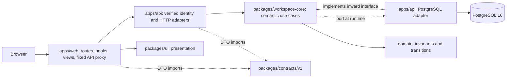

# ADR 004: Layered modular backend with PostgreSQL

**M2 implementation update:** the remote web cutover, fixed proxy/SSR identity, durable import/export/rollback, optional offline auth utility, resolved-import ESLint boundaries, Compose and real-PG CI are implemented. M1/M2 future-tense notes below record the original sequencing, not remaining SQLite runtime ownership. See [current architecture](architecture.md), [operations](postgres-operations.md), and [verification mapping](postgres-verification.md). Final release remains independently reviewed and supervisor-published.

- Date: 2026-09-05
- Decision: approved architecture and explicit PostgreSQL user directive; staged implementation, release acceptance pending
- Supersedes: ADR 002's database selection and prior architecture-stage restrictions, not its data-preservation or authentication requirements

## Context and decision

Projects/tasks were per-account browser data, not existing backend CRUD. This is a storage/ownership change, not a folder-only refactor. Adopt one Hono/Node API with Better Auth and PostgreSQL, a separate TanStack Start web/SSR process, strict versioned contracts, presentation-only UI, and a small business/application core. [Research](architecture-research.md) supplies evidence and tradeoffs.

## Boundary policy

- Domain knows no React, HTTP, SQL, environment, browser storage or runtime crypto/clock. Zod is allowed for authoritative invariants. IDs and clock are injected.
- Application depends on domain and owns `Actor` and `WorkspaceTransactions`. Adapter contracts promise owner scoping, revision checks, consistent snapshots and atomic changes.
- PostgreSQL adapter depends inward on the core, never the reverse. HTTP validates wire DTOs, maps sanitized errors and supplies only a verified actor. Composition uses ordinary factories.
- Contracts depend only on Zod, not domain/DB models. v1 compatible additions remain v1; breaking changes require a new version.
- Web imports contracts/UI, never API internals or server use cases. UI knows presentation/accessibility only. Relative-path bypasses are equally forbidden. Package exports already expose narrow entry points; full graph/lint enforcement is a required M2 gate.
- Existing web domain/persistence is explicitly transitional through M1; do not remove it before the remote/error/import UI exists. Root 24-test Astra runner behavior is out of scope and must remain unchanged.

## HTTP contract and limits

- `GET /api/v1/session`: fresh token-free `{sessionId,user:{id,name,email}}`; missing/revoked/expired identity is 401, DB/API failure is 503.
- **Every workspace request** requires `X-Expected-Session-Id`, including reads, details, mutations and future import/export/rollback. Capture it from the dispatching session lease; it is a bounded 1–128 ASCII alphanumeric/underscore/hyphen value. First verify the cookie, then compare with its verified session ID **before business reads/writes**. Missing/invalid binding is `400 SESSION_BINDING_REQUIRED`; mismatch (also same-user replacement) is `409 SESSION_CHANGED`. The header never selects the actor. Session discovery is exempt; all other `/api/v1/*` paths are gated, even unknown routes. M2 proxy/SSR must preserve the header and clients must hide/invalidate/reconcile on mismatch, not replay drafts. Epoch keys and pre/post action-lease checks remain required: this precondition closes the shared-cookie tab-switch race they cannot prevent alone. Contracts export `expectedSessionHeader`, `expectedSessionIdSchema` and `WorkspaceSessionHeaders`.
- `GET /api/v1/workspace`: canonical `{revision,projects,tasks}`, ETag containing quoted revision.
- `/api/v1/projects`, `/api/v1/tasks`: GET lists return `{revision,projects}` or `{revision,tasks}`; GET `/:id` returns `{revision,item}`. POST and PATCH `/:id` require full strict input plus `expectedRevision`; PATCH is a full editable-field update, not JSON Merge Patch. Project PATCH includes `archived`; task PATCH preserves project and creation time.
- DELETE `/:id` requires quoted `If-Match`. Project deletion also requires JSON `{confirm:"exact current project name"}` and atomically cascades its tasks. This confirmation/cascade is a new explicit policy; M2 UI must expose it. Existing tasks on archived projects remain editable/deletable; new tasks are forbidden and tasks cannot move projects.
- Mutations return the committed canonical snapshot. Revision conflict is 409, never silently replayed. Foreign and missing resource IDs are indistinguishable 404 after authentication.
- Strict unknown-field rejection prevents client owner/ID/timestamp claims. IDs/timestamps come from server values. New accounts have revision zero and empty arrays, not persisted demos.
- At most 100 projects, 1,000 tasks and 2 MiB request bodies. Names/descriptions retain 60/280 and 120/500 character limits and original statuses. NUL characters are explicitly invalid because PostgreSQL text cannot represent them. This is a small-workspace aggregate, **not pagination**. Enforce an additional serialized UTF-8 budget of 2 MiB minus 4 KiB on every mutation: JSON escaping can exceed the byte budget even when character counts pass. Reserve that margin for M2 import metadata so valid exports can be reimported.
- Error envelope: `{error:{code,message,requestId}}`; 400 validation, 401 sign-in required, 403 CSRF, 404 absent/foreign, 409 rule/revision conflict, 413 body too large, 429 limited, 503 unavailable. Opaque Better Auth responses retain its upstream contract except sanitized 5xx and unconfirmed successful sign-out (see below). No client SQL, credentials, hashes or stacks.

## Transactions, security and operations

Owner row creation/lock, revision comparison, domain transition, aggregate replacement and revision increment share one transaction/client. Composite owner/ID primary and foreign keys prevent cross-owner task references. Repeatable-read GETs cannot mix revisions and children. Bounded whole-aggregate replacement is deliberately simple; optimize to diff/batch writes only with measurements and preservation tests.

Migrations are reviewed SQL files, checksummed in a ledger and applied under a session advisory lock plus transaction on **one client**. Drift/unknown versions reject. Build never reads database configuration or runs migrations. Explicit `pnpm --filter api migrate` (source) or `node migrate.mjs` (artifact) is required. Runtime checks ledger/checksums and schema queries; pending/unavailable database yields 503 on dependency-bearing routes, including `/health/ready` and auth. Exact `/health/live` remains independent process liveness. No automatic production migration. Auth is instantiated only after this gate; guard initialization uses only the read-only pool.

Two bounded runtime pools (six connections each), 3s acquisition, 5s statements/idle-in-transaction, 2s locks, 10s workspace transaction deadline, 12s handler deadline **including readiness**, 16 KiB headers, 10s header/15s request/5s keepalive settings, bounded 15s shutdown. Deployment capacity must account for both pools and every process. URL query options cannot override read-only/timeouts/search_path; only `sslmode` is accepted. Handler timeout cannot undo a commit; reconcile after ambiguous responses. Auth rate limits retain a conservative shared bucket because forwarding headers are untrusted. Workspace traffic adds 120 requests/minute/account, one persistent row per account.

Public auth refresh/cookie handling remains Better Auth's responsibility. **Narrow sign-out confirmation:** Better Auth 1.7.3 can swallow a session DELETE failure and return 200 with cookie expiration. Before forwarding successful POST sign-out or any of its cookies, the wrapper verifies the ORIGINAL request cookie through the read-only guard. A still-valid session or database verification failure returns sanitized 503 without forwarding the false cookie expiration; retry after resolving the database failure. No custom cookie parser, token interpretation or change to public session refresh is introduced. A separate non-public GET guard uses deferSessionRefresh + disableRefresh + disableCookieCache with PostgreSQL read-only enforcement. Backend never trusts x-user-id, forwarded IP, or body ownership. Mutations require the exact trusted public Origin and reject cross-site Fetch Metadata. Private/no-store and separate Set-Cookie values must survive M2 proxy and SSR.

The API build assembles a fresh, uniquely owned staging directory anchored to the build script, then replaces only its owned `dist`. It never merges old migrations or assets into a new artifact; an executed-build regression checks the artifact migration loader against the current source plan. Failed staging is cleaned in finally.

Standalone API output bundles production dependencies into ESM plus migration SQL; it requires Node, not TypeScript, workspace source or symlinked node_modules. A copied temporary artifact is tested with an owned database and process restart, plus SIGTERM during an observed active database transaction: HTTP drains, the committed revision survives restart, and the process exits within the shutdown bound. Real PostgreSQL security tests also cover failed DELETE logout, cookie/session binding, HTTPS-origin Secure cookies, archive/create races using two checked-out clients, and combined readiness/downstream delays with pool cleanup. These are not PostgreSQL-service-restart or browser/proxy proofs. M2 still owns deployment/Compose/CI/browser and full publication gates.
